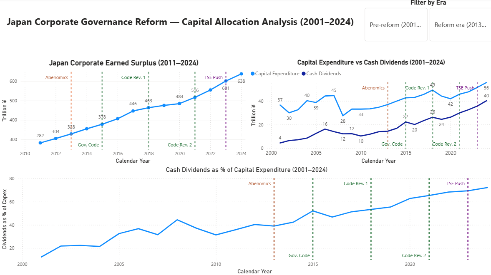
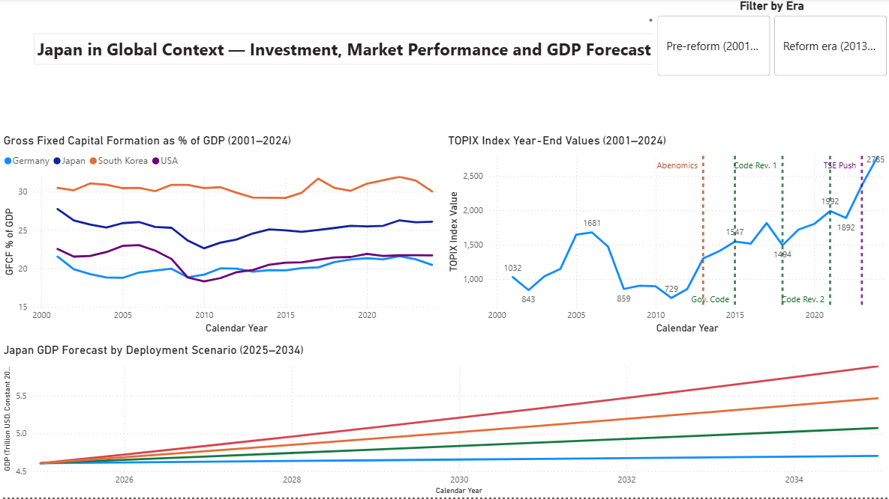

# Japan Corporate Governance Reform - Capital Allocation and Economic Impact Analysis (2001-2024)

## Executive Summary

This project presents a 24 year quantitative analysis of Japan's 
corporate governance reform program and its measurable impact on 
corporate capital allocation behavior, equity market performance, 
and macroeconomic outcomes, produced as a research analytics 
exercise using real public data from the Ministry of Finance, 
Japan Exchange Group, and World Bank. The analysis was built to 
provide the quantitative evidence base for institutional-level 
questions about Japan's capital markets, the kind of empirical 
foundation that portfolio managers, corporate strategy researchers, 
and financial analysts require before drawing their own conclusions.

Three findings of particular analytical significance emerged. 
Japan's corporate earned surplus has grown 126% since 2011, 
reaching ¥637.5 trillion in 2024 with no meaningful deceleration 
at any governance reform milestone. The proportion of profits 
returned to shareholders versus reinvested shifted dramatically, with
dividends as a percentage of capital expenditure rose from 12% in 
2001 to 72% in 2024. Corporate capital expenditure and TOPIX 
performance exhibit a near-perfect positive correlation across the 
full analytical window (r = 0.913), with the strongest sustained 
market rally in the dataset occurring in the two years following 
the 2023 TSE capital efficiency directive. GDP scenario modeling 
projects $0.37T-$1.19T in additional output by 2034 if 5-15% of 
current surplus is deployed.

---

## Business Problem

Japan's listed companies had accumulated an estimated ¥637.5 
trillion in corporate earned surplus as of 2024; idle retained 
profits that have persisted despite a decade of escalating 
governance reform pressure from Japan's Financial Services Agency 
and Tokyo Stock Exchange. Whether these policy interventions can 
meaningfully change deeply entrenched corporate behavior is a 
question with direct implications for equity investors, 
multinational corporations evaluating Japan exposure, and financial 
research organizations monitoring reform progress. This analysis 
was built to provide a quantitative evidence base for five core 
questions:

1. How have Japanese corporate cash holdings changed over time 
relative to governance reform milestones, and has the reform 
program altered the accumulation trend?

2. Has capital expenditure increased as a proportion of corporate 
profits since the TSE's 2023 capital efficiency push, or are 
companies primarily returning cash to shareholders through 
dividends rather than investing?

3. How does Japan's corporate investment behavior compare to peer 
economies (United States, Germany, South Korea) as a percentage of 
GDP over the same period?

4. Is there a measurable statistical correlation between governance 
reform milestones and Japan's stock market performance as measured 
by the TOPIX index?

5. Based on historical relationships between corporate investment 
and GDP growth, what range of economic outcomes could be expected 
if companies deployed varying proportions of their idle capital 
over a five to ten year horizon?

---

## Dashboard

**Page 1 — Capital Allocation**


**Page 2 — International Context & GDP Forecast**


---

## Methodology

1. **Scope Definition:** Established five core business questions, 
a 2001–2024 analytical window, four peer economies for 
international comparison, and percentage of GDP as the primary 
cross-country normalization unit.

2. **Data Sourcing and Integration:** Collected data from three 
public sources — 23 Ministry of Finance annual survey Excel files 
(FY2002–FY2024), TOPIX historical index records from the Japan 
Exchange Group, and World Bank World Development Indicators for 
four countries. Applied a most-recently-published deduplication 
strategy for overlapping MoF file coverage. Final master datasets: 
japan_master.csv (24 rows, 14 columns) and peer_comparison.csv 
(24 rows, 17 columns). Finance and Insurance industries are 
excluded from MoF figures throughout to maintain structural 
consistency across the full time series; their inclusion in later 
survey years without equivalent earlier data would have introduced 
a structural discontinuity.

3. **Exploratory Data Analysis (Python):** Produced ten charts 
examining earned surplus accumulation, capital expenditure versus 
dividends, TOPIX trends, four-country GFCF comparison, Japan GDP 
growth, the savings-investment gap, and correlation analysis. 
Governance reform milestones were marked as reference points across 
all time-series charts.

4. **Regression Modeling and Scenario Forecasting (Python):** 
Tested same-year and lagged correlations between CapEx growth and 
GDP growth, identifying a statistically significant one-year lag 
relationship (Pearson r = 0.757, p = 0.0001). Built an OLS 
regression model (R² = 0.574) as the empirical foundation for 
three GDP deployment scenarios projecting outcomes through 2034.

5. **SQL Analysis (SQLite):** Imported master datasets into a 
SQLite database connected to Power BI via ODBC. Wrote seven 
queries validating key findings across earned surplus growth, 
capital deployment era comparisons, peer GFCF rankings, TOPIX 
milestone performance, and the investment-to-GDP directional 
relationship.

6. **Dashboard (Power BI):** Built a two-page interactive 
dashboard connected to the SQLite database via ODBC. Page 1 
covers corporate capital allocation; Page 2 covers international 
context and the GDP forecast. Governance reform milestones are 
marked as reference lines across all time-series charts; an Era 
slicer filters all visuals simultaneously between pre-reform and 
reform era data.

---

## Skills

**Python (pandas, matplotlib, seaborn, scipy, sklearn):** 
Multi-source data cleaning and integration across 23 structurally 
inconsistent Excel files, EDA producing 10 charts, OLS regression 
modeling, GDP scenario forecasting

**SQL (SQLite):** 7 analytical queries, era-based aggregation, 
governance milestone flagging, GFCF peer ranking, 
investment-to-GDP directional analysis, ODBC pipeline to Power BI

**Power BI:** Two-page interactive dashboard, governance reform 
milestone reference lines, Era slicer for pre-reform vs. reform 
era filtering, live ODBC connection to SQLite database

---

## Results

**Surplus accumulation has continued uninterrupted through every 
reform milestone.** Japan's corporate earned surplus grew 126% 
between 2011 and 2024, rising from ¥281.7 trillion to ¥637.5 
trillion in an unbroken upward trend. The rate of accumulation 
showed no meaningful deceleration at any governance reform 
milestone, suggesting aggregate compliance with the Corporate 
Governance Code has not yet produced a reversal of the fundamental 
capital hoarding pattern.

**Corporate profit distribution has structurally shifted toward 
shareholder returns.** Cash dividends grew nearly sixfold from 
¥7.2 trillion in 2003 to ¥40.1 trillion in 2024, while capital 
expenditure rose 52% from ¥36.5 trillion to ¥55.5 trillion over 
the same period. Dividends as a percentage of capital expenditure 
rose from 12% in 2001 to 72% in 2024, with the most pronounced 
acceleration after 2013. Total dividends paid during the reform 
era exceeded pre-reform era totals by ¥181.7 trillion.


**Japan maintains a relatively strong investment rate by 
international comparison.** Japan ranked second among four peer 
economies in gross fixed capital formation as a percentage of GDP 
throughout the full 24 year period, behind South Korea and ahead 
of Germany and the United States. Japan's investment rate 
recovered from a post-crisis low of 22.6% in 2010 to 26.1% by 
2024, establishing that the governance reform challenge is not an 
absence of investment but an accumulation of surplus capital that 
outpaces investment performance.

**Corporate investment and stock market performance are strongly 
correlated.** Capital expenditure and TOPIX exhibit a Pearson 
correlation of 0.913 (R² = 0.833) across the 24 year window. A 
statistically significant one-year lag was identified between CapEx 
growth and GDP growth (p = 0.0001). The strongest sustained market 
rally in the dataset occurred in the two years following the 2023 
TSE capital efficiency directive with TOPIX gaining 25.1% in 2023 and 
17.7% in 2024.


**GDP scenario modeling projects a meaningful range of 
macroeconomic outcomes.** Assuming 5-15% of current surplus is 
deployed over ten years, the OLS regression model projects 
$0.37T-$1.19T in additional GDP by 2034 relative to a 
no-deployment baseline. These projections carry a residual 
uncertainty of 1.44 percentage points per year widening over the 
forecast horizon and should be treated as a directional reference 
range rather than precise planning targets.


---

## Business Recommendation

The following outputs are intended to provide an evidence-based 
analytical foundation for stakeholders with domain expertise in 
Japanese capital markets, institutional investment, or corporate 
strategy. Conclusions about specific investment, policy, or 
operational decisions would require additional proprietary data 
and subject matter expertise beyond the scope of this analysis.

**For equity analysts and portfolio managers monitoring Japan 
exposure:** The strong historical correlation between corporate 
capital expenditure and TOPIX performance (r = 0.913) suggests 
that corporate investment behavior may function as a meaningful 
leading indicator alongside traditional market metrics. The 2023 
TSE directive produced the most sustained two-year TOPIX rally in 
the dataset and monitoring whether this momentum persists through 
the July 2027 governance code compliance deadline may be 
informative for medium-term Japan equity positioning.

**For corporate strategy and M&A research teams:** The structural 
shift in profit distribution, dividends as a percentage of CapEx 
rising from 12% to 72% over the reform period, represents a 
material change in how Japanese listed companies deploy profits. 
Whether this pattern reflects genuine strategic reallocation or 
primarily cash distribution in mature, low-growth industries 
cannot be determined from aggregate data. Company-level and 
sector-level financial analysis would be required to make that 
distinction, which is material to evaluating individual companies 
or sectors.

**For financial research organizations:** The GDP scenario range 
($0.37T-$1.19T in additional output by 2034) provides a 
quantitative directional framework for assessing the macroeconomic 
significance of surplus deployment at scale. Actual outcomes would 
depend on the sector concentration of deployment, the composition 
of investment types, and conditions external to any 
investment-based model.

---

## Next Steps

**Sector-level decomposition:** The aggregate shift from a 30.6% to 56.5% dividend-to-CapEx ratio between pre-reform and reform eras is an economy-wide finding. Whether this pattern is consistent across industries or concentrated in specific sectors cannot be determined from the data used in this analysis. Company-level or sector-level financial data would enable the more granular assessment required to evaluate reform impact at a meaningful operational level.

**Share buyback integration:** Share buyback data was not incorporated due to the absence of a freely accessible historical time series at the required aggregation level. To the extent that buybacks have grown as an alternative return mechanism during the reform era (which professional reporting suggests to be the case) the shift toward shareholder returns identified here may be understated. A complete capital return analysis would incorporate buyback data alongside dividends.

**Reform compliance monitoring:** The July 2027 compliance deadline for the revised Corporate Governance Code represents the most meaningful near-term test of whether the reform program can reverse the surplus accumulation trend. An updated analysis using 2025–2027 data would provide the first evidence-based assessment of whether the TSE's 2023 directive has produced durable behavioral change or primarily a temporary market response.

**Savings-investment gap investigation:** An incidental finding outside the primary analytical scope: Japan's gross domestic savings rate fell below its gross fixed capital formation rate in several years after 2013, producing a negative savings-investment gap counter intuitive against the central finding of uninterrupted corporate surplus growth. This likely reflects government fiscal deficits and declining household savings, but the aggregate data used here does not permit sector-level resolution. It is noted as an area warranting further research by analysts with access to dis-aggregated national accounts data.

**Model refinement:** The GDP scenario model is built on aggregate national investment and GDP data rather than corporate-sector- specific data, meaning the historical investment multiplier reflects non-corporate activity alongside corporate investment. A corporate-sector-specific model using dis-aggregated investment data would produce more precise scenario estimates.

---

## Repository Structure

```bash
Japan-Governance-Analysis/
│
├── README.md                                         — This document
│
├── data/
│   ├── raw/
│   │   ├── worldbank/                                — World Bank WDI export (CSV)
│   │   ├── mof_annual/                               — 23 MoF annual survey Excel files (FY2002–FY2024)
│   │   ├── mof_quarterly/                            — MoF seasonally adjusted quarterly series
│   │   └── jpx/                                      — TOPIX annual index historical file
│   ├── cleaned/
│   │   ├── worldbank_cleaned.csv                     — World Bank long format, 4 countries, 4 indicators
│   │   ├── mof_capex_cleaned.csv                     — Japan capital expenditure 2001–2024
│   │   ├── mof_dividends_cleaned.csv                 — Japan cash dividends 2001–2024
│   │   ├── mof_surplus_cleaned.csv                   — Japan earned surplus 2011–2024
│   │   ├── topix_cleaned.csv                         — TOPIX annual index values 2000–2025
│   │   ├── japan_master.csv                          — Primary Japan analytical dataset (24 rows, 14 columns)
│   │   ├── peer_comparison.csv                       — Four-country peer comparison dataset (24 rows, 17 columns)
│   │   ├── forecast_scenarios.csv                    — GDP scenario projections 2025–2034 (44 rows, 9 columns)
│   │   └── governance_milestones.csv                 — Governance reform milestone reference table
│   └── charts/
│       └── [10 PNG files]                            — Python EDA and forecast visualizations
│
├── python/
│   ├── Japan_Governance_Cleaning.ipynb               — Multi-source data cleaning and integration notebook
│   └── Japan_Governance_EDA.ipynb                    — EDA, regression modeling, and scenario forecast notebook
│
├── sql/
│   ├── japan_governance.db                           — SQLite database (Power BI connects via ODBC)
│   ├── 01_earned_surplus_milestones.sql              — Surplus growth with governance milestone flags
│   ├── 02_capex_dividends_ratio.sql                  — Capital deployment ratio over time
│   ├── 02b_era_summary.sql                           — Pre-reform vs reform era aggregated comparison
│   ├── 03_peer_gfcf_comparison.sql                   — Four country GFCF ranking by year
│   ├── 04_topix_milestone_performance.sql            — TOPIX performance around reform milestones
│   ├── 05_gdp_investment_relationship.sql            — Investment-to-GDP directional relationship
│   └── 05b_direction_summary.sql                     — Direction relationship category summary
│
├── dashboard/
│   ├── Japan_Governance_Analysis_Dashboard.pbix      — Interactive Power BI dashboard (2 pages, ODBC connected)
│   ├── dashboard_screenshot_page1.png                — Page 1 screenshot: Capital Allocation
│   └── dashboard_screenshot_page2.png                — Page 2 screenshot: International Context & Forecast
│
└── insights/
    └── Japan_Governance_Insight_Narrative.docx        — Full business narrative and observations
```

---

## How to Run

This project requires Python with pandas, matplotlib, seaborn, scipy, and sklearn installed via Anaconda, a SQLite-compatible SQL client for the SQL queries and database, and Power BI Desktop with a SQLite ODBC driver installed for the dashboard file. All raw data files are located in the data/raw subfolders and all cleaned analytical files are located in data/cleaned.

**To explore the Python notebooks:**

    1. Open Anaconda Navigator and launch Jupyter Notebook. 
    2. Navigate to the python folder and open either notebook. 
    3. Ensure the data/cleaned folder is accessible from the same working directory. 
    4. Run all cells in order using Kernel: Restart and Run All. 
    
**To run the SQL queries:**

    1. Open any SQL client and create a new SQLite connection pointing to japan_governance.db in the sql folder. 
    2. Open any .sql file from the sql folder in the SQL client editor. 
    
**To view the Power BI dashboard:**

    1. Install the SQLite ODBC driver from ch-werner.de/sqliteodbc.
    2. Create a System DSN named japan_governance connecting to japan_governance.db using the Windows ODBC Data Source Administrator.
    3. Open Japan_Governance_Analysis_Dashboard.pbix in Power BI Desktop. 
    4. If prompted to refresh the data source confirm the ODBC connection is correctly configured.
