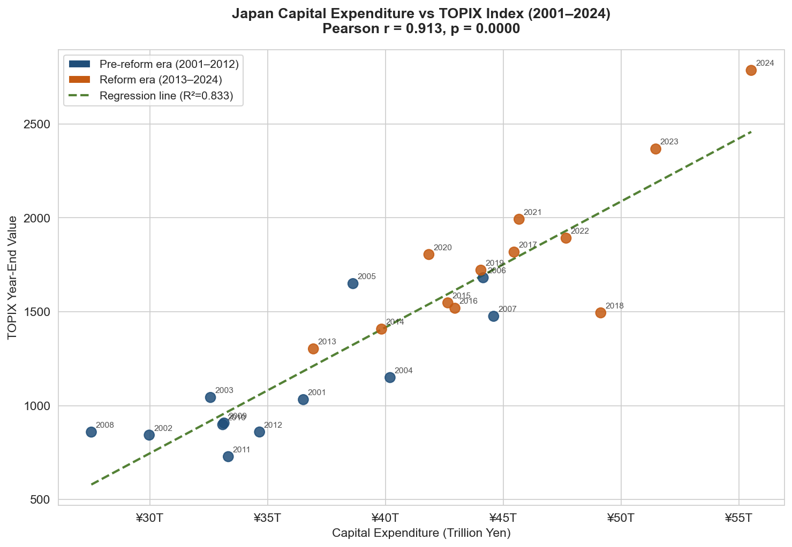
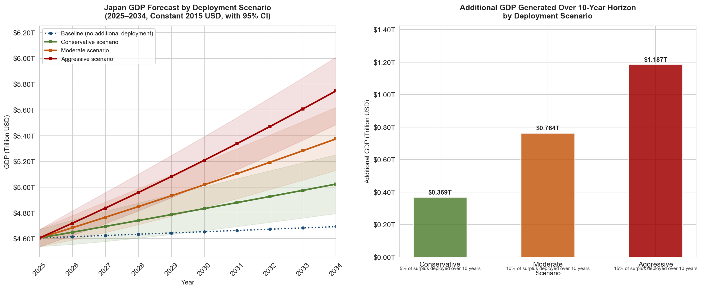
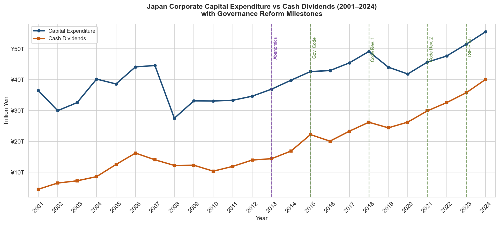

# Japan Corporate Governance Reform - Capital Allocation and Economic Impact Analysis (2001–2024)

## Overview 
This project presents an end-to-end data analysis of Japan's corporate governance reform program and its measurable impact on corporate capital allocation behavior, stock market performance and macroeconomic outcomes over a 24 year period from 2001 to 2024. Drawing on real public data from the Japan Ministry of Finance, the Japan Exchange Group, and the World Bank, the project covers the full analyst workflow: multi-source data sourcing and integration, data cleaning, exploratory data analysis, regression modeling, scenario forecasting, SQL validation, and interactive dashboard creation, using Python, SQL, and Power BI.

---

## Business Problem
Japan's listed companies have accumulated an estimated ¥637.5 trillion in corporate earned surplus as of 2024 that sits ase idle retained profits rather than being deployed into productive investment or returned to shareholders. This idle capital accumulation has persisted despite a decade of escalating governance reform pressure from Japan's Financial Services Agency and Tokyo Stock Exchange, raising fundamental questions about whether policy interventions can meaningfully change deeply entrenched corporate behavior. This analysis was designed to answer five core business questions:

  1. How have Japanese corporate cash holdings changed over time relative to governance reform milestones, and has the reform program altered the accumulation trend? 
  2. Has capital expenditure increased as a proportion of corporate profits since the TSE's 2023 capital efficiency push, or are companies primarily returning cash to shareholders through dividends rather than investing? 
  3. How does Japan's corporate investment behavior compare to the peer economies of the United States, Germany, and South Korea as a percentage of GDP over the same period? 
  4. Is there a measurable statistical correlation between governance reform milestones and Japan's stock market performance as measured by the TOPIX index? 
  5. Based on historical relationships between corporate investment and GDP growth in Japan, what range of economic outcomes could be expected if companies deployed varying proportions of their idle capital over a five to ten year horizon?
    
---

## Tools and Technologies

**Python (pandas, matplotlib, seaborn, scipy, sklearn):** Used for data loading, cleaning, and integration across multiple heterogeneous source files. The cleaning process addressed structural inconsistencies across 26 Ministry of Finance Excel files spanning two decades, including shifting sheet numbering conventions, non-consecutive column layouts, overlapping multi-year coverage, and fiscal year to calendar year alignment. Exploratory data analysis produced ten charts examining corporate surplus accumulation, capital deployment behavior, peer economy comparisons, stock market correlations, and GDP trends. Regression modeling using scipy and sklearn established a statistically significant one year lag relationship between capital expenditure growth and GDP growth, forming the empirical foundation of the scenario forecast.

**SQL (SQLite via DBeaver):** Used to validate key Python findings through structured queries and surface additional analytical insights through direct database interrogation. Seven queries covered earned surplus growth relative to governance milestones, capital deployment era comparisons, four-country GFCF rankings, TOPIX performance around reform announcements, and the historical investment-to-GDP growth relationship. The project connects Power BI directly to the SQLite database via an ODBC connection and demonstrates a database-to-dashboard pipeline architecture.


**Power BI:** Used to build an interactive two-page dashboard visualizing the core findings for a business audience. Page 1 presents the internal corporate capital allocation story. Page 2 presents the international context and GDP forecast. Governance reform milestones are marked as reference lines across all time-series charts. An Era slicer allows filtering between pre-reform and reform era data across all visuals simultaneously.

---

## Dataset
This project uses real publicly available data sourced from three government and international statistical organizations.

1. Japan’s Ministry of Finance - Financial Statements Statistics of Corporations by Industry
Annual survey data covering Japanese corporate financial behavior from FY2002 through FY2024, providing capital expenditure, cash dividends, and earned surplus figures for all industries excluding Finance and Insurance. The survey has been conducted since 1948 and represents the most comprehensive publicly available source of Japanese corporate financial aggregates. Data was extracted from 23 individual Excel files, each containing five years of overlapping data with sheet numbering conventions that shifted between FY2014 and FY2015, requiring conditional extraction logic to handle both structural periods consistently. Data was sourced directly from Japan’s Ministry of Finance’s Policy Research Institute portal.

2. Japan Exchange Group - TOPIX Historical Index Values
Annual TOPIX index records covering first trading day values, annual highs and lows, and year-end closing values from 1949 through 2025. Year-end closing values were used as the primary analytical variable for consistency across the time series. Data was sourced directly from the Japan Exchange Group's public statistics portal.


3. World Bank - World Development Indicators
Four indicators downloaded for Japan, the United States, Germany, and South Korea covering 2000 through 2024: GDP at constant 2015 USD, GDP per capita at constant 2015 USD, gross domestic savings as a percentage of GDP, and gross fixed capital formation as a percentage of GDP. Constant 2015 USD pricing eliminates inflation that would have distorted the time series analysis. Percentage of GDP normalization enables cross-country comparison independent of currency and economic scale differences.

The analytical window for this project is 2001 through 2024, providing 24 years of data with 13 years of pre-reform baseline and 11 years of reform era coverage. Earned surplus data is available from 2011 onwards only, reflecting the Ministry of Finance's creation of the earned surplus category in FY2015 publications.

---

## Project Workflow

   1. Scope Definition: Defined the business problem, selected the analytical topic, established five core business questions, determined the 2001-2024 analytical window, selected four peer economies for international comparison, and established percentage of GDP as the primary cross-country normalization unit. 
       
   2. Data Sourcing: Located and downloaded data from three public sources: 23 Ministry of Finance annual survey Excel files, TOPIX historical index records from the Japan Exchange Group, and four-indicator World Bank World Development Indicators exports for four countries. Evaluated data availability, format consistency, and coverage gaps before committing to the analytical scope. 
       
   3. Data Cleaning and Integration: Cleaned and standardized each dataset individually before assembling two master analytical files. Key challenges included extracting consistent time series from 23 structurally inconsistent MoF Excel files across two structural periods, aligning Japanese fiscal years to calendar years, normalizing cross-country World Bank indicators, and resolving overlapping multi-year coverage across consecutive MoF files using a most-recently-published deduplication strategy. Final master datasets: japan_master.csv (24 rows, 14 columns) and peer_comparison.csv (24 rows, 17 columns). 

   4. Exploratory Data Analysis (Python): Produced ten charts examining earned surplus accumulation over time, capital expenditure versus dividends, dividends as a percentage of capex, TOPIX index trends, four-country GFCF comparison, Japan GDP growth, the savings-investment gap, capex-TOPIX correlation, dividends-TOPIX correlation, and GDP forecast scenarios. Governance reform milestones were marked as reference points across all time-series charts. 

   5. Regression Modeling and Scenario Forecast (Python): Tested same-year and lagged correlations between CapEx growth and GDP growth, identifying a statistically significant one year lag relationship with Pearson r of 0.757 and p-value of 0.0001. Built an OLS regression model with R² of 0.574 serving as the empirical foundation for three GDP deployment scenarios projecting outcomes through 2034. 

   6. SQL Analysis (SQLite via DBeaver): Imported master datasets into a SQLite database connected to Power BI via ODBC. Wrote seven queries validating key findings across earned surplus growth, capital deployment era comparisons, peer GFCF rankings, TOPIX milestone performance, and the investment-to-GDP directional relationship. 

   7. Dashboard (Power BI): Built a two-page interactive dashboard connected directly to the SQLite database via ODBC. Page 1 presents the corporate capital allocation story and page 2 presents international context and the GDP forecast. Governance reform milestones are marked as reference lines across all time-series charts. An Era slicer filters all visuals simultaneously between pre-reform and reform era data. 

   8. Insight Narrative: Wrote a structured business document translating analytical findings into plain language for a stakeholder audience, covering executive summary, business context, key findings, observations for further investigation, an additional incidental finding, and a methodology note. 

   9. Documentation: Organized project files into a structured repository and produced this README.
    
---

## Key Findings

   • Japan's corporate earned surplus grew 126% between 2011 and 2024, rising from ¥281.7 trillion to ¥637.5 trillion in an unbroken upward trend. The rate of accumulation showed no meaningful deceleration at any governance reform milestone, suggesting aggregate compliance with the Corporate Governance Code has not yet translated into a reversal of the fundamental capital hoarding pattern. 

   • Cash dividends grew nearly sixfold from ¥7.2 trillion in 2003 to ¥40.1 trillion in 2024, while capital expenditure rose 52% from ¥36.5 trillion in 2001 to ¥55.5 trillion in 2024. Dividends as a percentage of capital expenditure rose from 12% in 2001 to 72% in 2024, with the most pronounced acceleration occurring after 2013. Total dividends paid during the reform era exceeded pre-reform era totals by ¥181.7 trillion, indicating a structural shift in how corporate profits are distributed. 

   • Japan ranked second among four peer economies in gross fixed capital formation as a percentage of GDP throughout the entire 24 year period, behind South Korea and ahead of Germany and the United States. Japan's investment rate recovered from a post-crisis low of 22.6% in 2010 to 26.1% by 2024, establishing that the governance reform challenge is not an absence of investment but an accumulation of surplus capital that outpaces investment performance. 

   • Corporate capital expenditure and the TOPIX index exhibit a strong positive correlation across the 24 year period with a Pearson coefficient of 0.913 and R² of 0.833. A statistically significant one year lag was identified between CapEx growth and GDP growth with a p-value of 0.0001. The strongest market signal of the reform era came after the 2023 TSE directive with TOPIX gaining 25.1% in 2023 and 17.7% in 2024, displaying the most sustained two year rally in the dataset. 

   

   • Scenario modeling projects between $0.37 trillion and $1.19 trillion in additional GDP by 2034 relative to a no-deployment baseline, assuming 5% to 15% of current surplus is deployed over ten years. Projections are based on a historical investment multiplier of 0.1323 and carry a residual uncertainty of 1.44 percentage points per year widening over the forecast horizon.

   


---

## Observations and Areas for Further Investigation

   • The unbroken surplus accumulation trend through every governance reform milestone suggests that aggregate compliance with the Corporate Governance Code has not yet produced a measurable reversal of corporate cash hoarding behavior. The July 2027 compliance deadline for the revised Code represents the most meaningful near-term test of whether the reform program can produce a reversal in this trend. 

   • The aggregate shift from a 30.6% to a 56.5% dividend-to-CapEx ratio between the pre-reform and reform eras warrants sector-level investigation. Whether this pattern is consistent across all industries or concentrated in specific sectors cannot be determined from the aggregate data used in this analysis. Company-level financial data would be required to assess whether governance reforms are producing genuine long-term investment in high-growth areas or primarily accelerating cash distributions in mature low-growth industries. 

   • The scenario projections of $0.37 trillion to $1.19 trillion in additional GDP through 2034 should be treated as a directional reference range rather than precise planning targets. The regression model's residual standard deviation of 1.44 percentage points reflects the influence of external shocks, such as the 2008 financial crisis and 2020 COVID contraction, that no investment-based model can reliably predict. 
      
   • An unexpected finding emerged outside the primary analytical scope. Japan's gross domestic savings rate fell below its gross fixed capital formation rate in several years after 2013, producing a negative savings-investment gap counterintuitive to the central finding of uninterrupted corporate surplus growth. This likely reflects compositional factors including government fiscal deficits and declining household savings, but the aggregate data used in this analysis does not permit the granular sector-level investigation required to resolve this question. It is noted here as an area warranting further research.

---

## Repository Structure


```bash
Japan-Governance-Analysis/
│
├── README.md                                         — This document
│
├── data/
│   ├── raw/
│   │   ├── worldbank/                                — World Bank WDI export (CSV)
│   │   ├── mof_annual/                               — 23 MoF annual survey Excel files (FY2002–FY2024)
│   │   ├── mof_quarterly/                            — MoF seasonally adjusted quarterly series
│   │   └── jpx/                                      — TOPIX annual index historical file
│   ├── cleaned/
│   │   ├── worldbank_cleaned.csv                     — World Bank long format, 4 countries, 4 indicators
│   │   ├── mof_capex_cleaned.csv                     — Japan capital expenditure 2001–2024
│   │   ├── mof_dividends_cleaned.csv                 — Japan cash dividends 2001–2024
│   │   ├── mof_surplus_cleaned.csv                   — Japan earned surplus 2011–2024
│   │   ├── topix_cleaned.csv                         — TOPIX annual index values 2000–2025
│   │   ├── japan_master.csv                          — Primary Japan analytical dataset (24 rows, 14 columns)
│   │   ├── peer_comparison.csv                       — Four-country peer comparison dataset (24 rows, 17 columns)
│   │   ├── forecast_scenarios.csv                    — GDP scenario projections 2025–2034 (44 rows, 9 columns)
│   │   └── governance_milestones.csv                 — Governance reform milestone reference table
│   └── charts/
│       └── [10 PNG files]                            — Python EDA and forecast visualizations
│
├── python/
│   ├── Japan_Governance_Cleaning.ipynb               — Multi-source data cleaning and integration notebook
│   └── Japan_Governance_EDA.ipynb                    — EDA, regression modeling, and scenario forecast notebook
│
├── sql/
│   ├── japan_governance.db                           — SQLite database (Power BI connects via ODBC)
│   ├── 01_earned_surplus_milestones.sql              — Surplus growth with governance milestone flags
│   ├── 02_capex_dividends_ratio.sql                  — Capital deployment ratio over time
│   ├── 02b_era_summary.sql                           — Pre-reform vs reform era aggregated comparison
│   ├── 03_peer_gfcf_comparison.sql                   — Four country GFCF ranking by year
│   ├── 04_topix_milestone_performance.sql            — TOPIX performance around reform milestones
│   ├── 05_gdp_investment_relationship.sql            — Investment-to-GDP directional relationship
│   └── 05b_direction_summary.sql                     — Direction relationship category summary
│
├── dashboard/
│   └── Japan_Governance_Analysis_Dashboard.pbix      — Interactive Power BI dashboard (2 pages, ODBC connected)
│
└── insights/
    └── Japan_Governance_Insight_Narrative.docx        — Full business narrative and observations
```

---

## Known Limitations

This project uses real publicly available data from government and international statistical sources, and the findings reflect the constraints inherent to those sources. The following limitations are acknowledged and should be considered when interpreting the results.

The Ministry of Finance survey data used in this analysis reflects All Industries excluding Finance and Insurance throughout the entire analytical window. While Finance and Insurance figures became available as a separate reporting category in later survey years, incorporating them would have introduced a structural discontinuity into the time series since the earlier files do not contain equivalent figures. The consistent exclusion of Finance and Insurance means the earned surplus, capital expenditure, and dividend totals reported here are conservative underestimates of true aggregate corporate figures, as the financial sector is among the largest holders of corporate cash in Japan.

Share buyback data was not incorporated into the capital deployment analysis due to the absence of a freely accessible historical time series at the required level of aggregation. Dividends are used as the primary measure of shareholder returns throughout the analysis. To the extent that share buybacks have grown as an alternative return mechanism during the reform era, which professional reporting suggests to be the case, the shift toward shareholder returns identified in this analysis may be understated.

Earned surplus data is available from 2011 onwards only, reflecting the Ministry of Finance's introduction of that reporting category in FY2015 publications. The pre-2011 period is therefore represented in the capital deployment analysis through CapEx and dividends data only, without a corresponding surplus accumulation measure.

The scenario forecast is based on aggregate national investment and GDP data rather than corporate-sector-specific investment data. Japan's gross fixed capital formation as reported by the World Bank includes government and household investment alongside corporate investment. Due to this the historical investment multiplier reflects non-corporate investment activity and the projected GDP impacts of corporate surplus deployment may differ from what the model suggests.

The use of aggregate national statistics throughout this analysis does not permit isolation of corporate sector behavior from household and government sector behavior. Findings and observations that reference aggregate macroeconomic indicators should be interpreted as economy-wide patterns rather than corporate-sector-specific conclusions.

---

## How to Run the Project

This project requires Python with pandas, matplotlib, seaborn, scipy, and sklearn installed via Anaconda, a SQLite-compatible SQL client such as DBeaver for the SQL queries and database, and Power BI Desktop with a SQLite ODBC driver installed for the dashboard file. All raw data files are located in the data/raw subfolders and all cleaned analytical files are located in data/cleaned.

**To explore the Python notebooks:**

    1. Open Anaconda Navigator and launch Jupyter Notebook. 
    2. Navigate to the python folder and open either notebook. 
    3. Ensure the data/cleaned folder is accessible from the same working directory. 
    4. Run all cells in order using Kernel: Restart and Run All. 
    
**To run the SQL queries:**

    1. Open DBeaver and create a new SQLite connection pointing to japan_governance.db in the sql folder. 
    2. Open any .sql file from the sql folder in the DBeaver SQL editor. 
    
**To view the Power BI dashboard:**

    1. Install the SQLite ODBC driver from ch-werner.de/sqliteodbc.
    2. Create a System DSN named japan_governance connecting to japan_governance.db using the Windows ODBC Data Source Administrator.
    3. Open Japan_Governance_Analysis_Dashboard.pbix in Power BI Desktop. 
    4. If prompted to refresh the data source confirm the ODBC connection is correctly configured.
